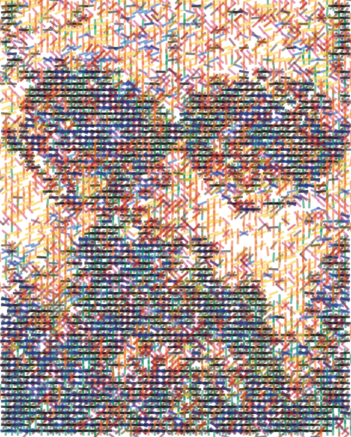
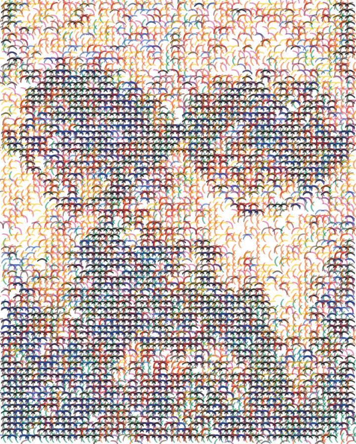
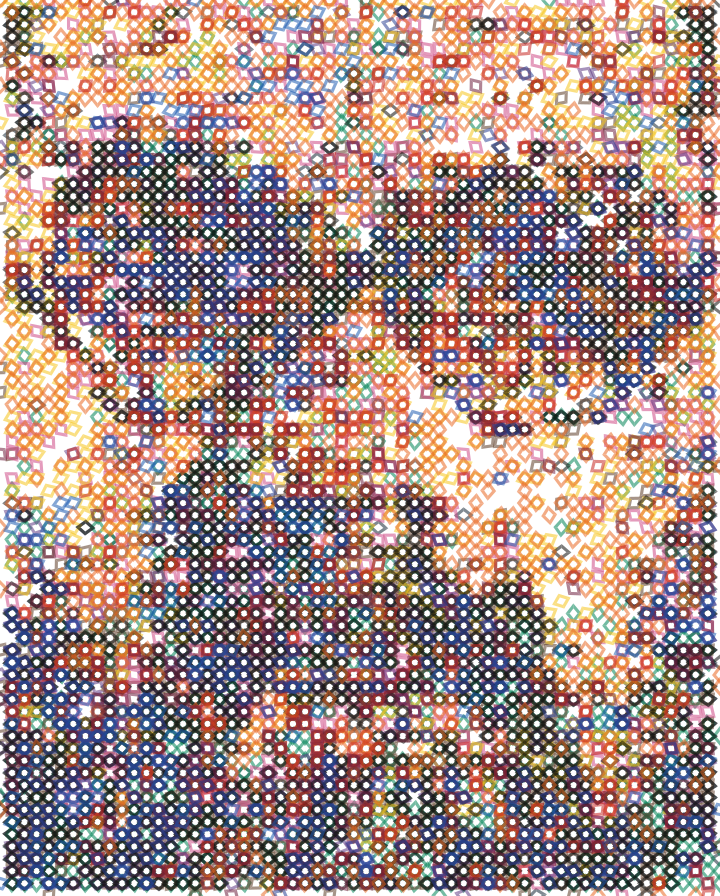
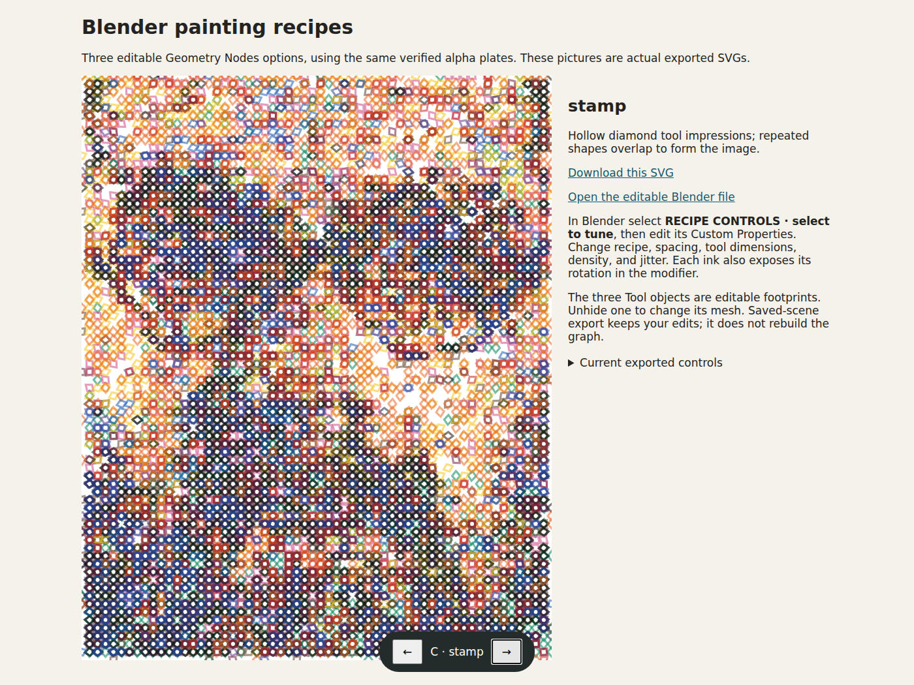
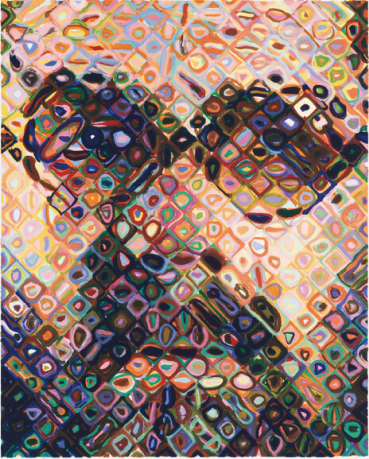
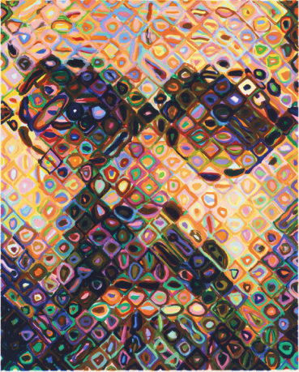

# Editable Blender painting recipes — prototype

The owner accepted the reproduced legacy output and asked for agent-built Geometry Nodes options that can be customized per painting. This first prototype keeps the same alpha plates and changes the mark construction rules.

**Owner feedback:** selecting one of these three styles is too narrow. They want to understand and control how toolpaths are constructed, in a CAM/slicer-like editing workflow. These artifacts demonstrate the mechanism only; they are not the accepted editor design. [Control research](https://github.com/Reid-Surmeier/Jax-Solve-Slicer/issues/10) precedes further editor development.

| Hatching | Curved bands | Tool impressions |
| --- | --- | --- |
|  |  |  |

[Download the editable Blender file](painting-recipes.blend) · [Hatch SVG](hatch.svg) · [Curve SVG](curve.svg) · [Impression SVG](stamp.svg)

## What you can change

Open the `.blend` in Blender 4.3.2. Select **RECIPE CONTROLS · select to tune** and open its Custom Properties. Recipe values are 0 = hatch, 1 = curve, 2 = impression. Adjust spacing, footprint length and width, density, and angular variation. Each plate object's Geometry Nodes modifier additionally exposes its rotation and input image.

The native graph samples the alpha image, creates a point grid, uses coverage to select points, chooses a tool mesh, instances it with rotation/scale, and realizes the result. The three **Tool · …** objects are the footprints: unhide one to edit its mesh. The graph and tools are editable Blender data, not a rendered approximation of a node system.

One Blender unit represents one millimetre. This is an explicit digital coordinate convention, not a measurement of the physical brush. Filled footprints can contain multiple polygons; in particular, one diamond impression has four faces. Polygon count is therefore not physical tool-contact count.

The included `index.html` compares exported results with a bottom recipe switcher. It is a static review of real outputs, not a live Blender editor. Open it alongside the included files or serve the directory locally. In Codex, use the share skill for a tailnet review URL.

## Re-export after editing

Save your edited `.blend` under a new name, then use `modules/blender_recipes/export_current.py` as shown in the root README. This reads the saved scene and exports evaluated geometry. It does not recreate the node graph or replace the tool meshes.

The exporter writes filled SVG paths in explicit millimetres directly from evaluated planar mesh polygons. It does not depend on a camera or viewport projection. A saved-scene export with spacing changed to 5 mm matched the corresponding generated SVG byte for byte. Exporting a geometry footprint is not yet motion planning, centerline extraction, or a calibrated paint operation.

## Mixbox experiment

| RGB recomposition | Official Mixbox recomposition |
| --- | --- |
|  |  |

The correct distribution is **pymixbox 2.0.0**, imported as `mixbox`. The legacy `mixbox==1.0.5` pin referred to an unrelated MITRE package. The new package passed endpoint and latent-interpolation checks; blue/yellow at 50% produced `(41, 130, 57)`.

This diagnostic performs ordered latent interpolation over the existing RGB-solved alpha plates and decodes once per pixel. It does not rerun the optimizer with a Mixbox objective. Its appearance therefore illustrates the effect of changing the rendering model, not a quality improvement. Standard SVG viewers still use ordinary SVG compositing; they do not apply Mixbox to overlapping marks.

Mixbox is provided under **CC BY-NC 4.0**, with separate commercial licensing terms. Exact reference source is vendored under `repos/mixbox`; the runtime imports the installed package, never the reference directory. NumPy and Pillow reference source are also pinned.

## Verified and still open

Generation, actual SVG rasterization, spacing changes, saved-scene re-export, official Mixbox API checks, browser recipe switching, and portable repository checks passed. The ported legacy SVG still matches the accepted original byte for byte. [receipt.json](receipt.json) records output hashes; [recipes.json](recipes.json) records the controls.

The owner still needs to choose useful mark families and control ranges. Physical tool calibration, a Mixbox-aware solve, and a verified live Blender MCP connection remain open. This experiment is intentionally kept on the build branch and is not a production release.
