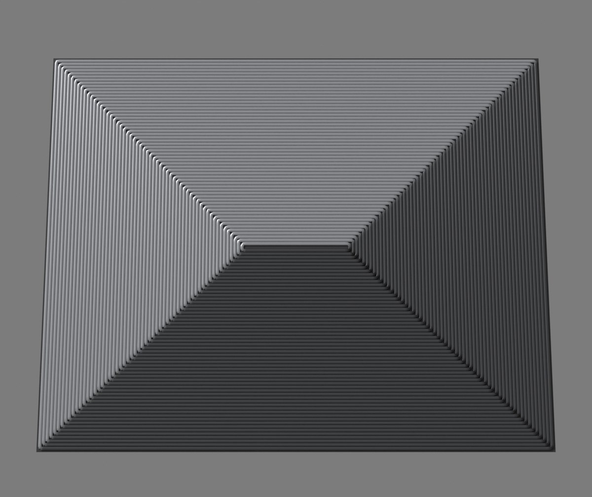

# Direction-coloured plate preview (prototype)

Throwaway prototype for [Prototype the direction-coloured plate preview on the two-portraits painting](https://github.com/Reid-Surmeier/Jax-Solve-Slicer/issues/20). It answers one question: does a contour toolpath coloured by travel direction look like the reference plate?



The picture above is the built-in check: a bare rectangle comes out as four facets in four tones, the same envelope seen on the back of the reference plate.

## What it does

1. `vectorize.py` turns the dark drawn lines of a picture into SVG outlines.
2. `build_preview.py` runs inside Blender:
   - a Geometry Nodes group, **Landform**, raises a grid by its distance to the nearest outline, so every slope is 45 degrees;
   - the GeoSlicer add-on's Planar slicer cuts it at one bead per layer, which gives contour lines one bead apart;
   - a second group, **Plate**, reads the add-on's `tangent`, `snormal` and `path` attributes, makes every loop travel with uphill on its left, turns travel direction into a tone, and lays beads on a shallow relief;
   - Cycles renders it and the `.blend` is saved with both groups live.

## Run it

GeoSlicer is https://github.com/luigipacheco/fabnodes at commit `817d7db`. Copy its three `.py` files into a folder named `geoslicer` and pass that folder's parent as `--addon-parent`. Blender 4.3.2 was used.

```bash
python3 vectorize.py PICTURE outlines.svg --crop X0 Y0 X1 Y1
blender -b --python build_preview.py -- --svg outlines.svg --addon-parent ADDONS --out OUT
blender -b --python build_preview.py -- --addon-parent ADDONS --out OUT   # rectangle check only
```

The script stops with an error unless at least 97% of bead points carry the tone their slope's facing asks for.

## What is a guess

- The filament: tone is the cosine of travel direction against one axis, between a charcoal and a silver. The colour-model research ticket replaces this.
- Outlines are the edges of the drawn lines, and the lines are the low points of the relief.
- The relief is the landform scaled to 3%.
- Small specks along the drawn lines are tiny loops inside the line's own width.

## Not here

The source picture, its outlines and the rendered preview are kept out of the repository because the picture is someone else's work. No G-code is written.
