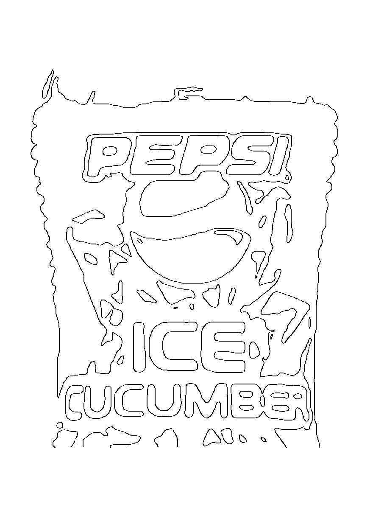
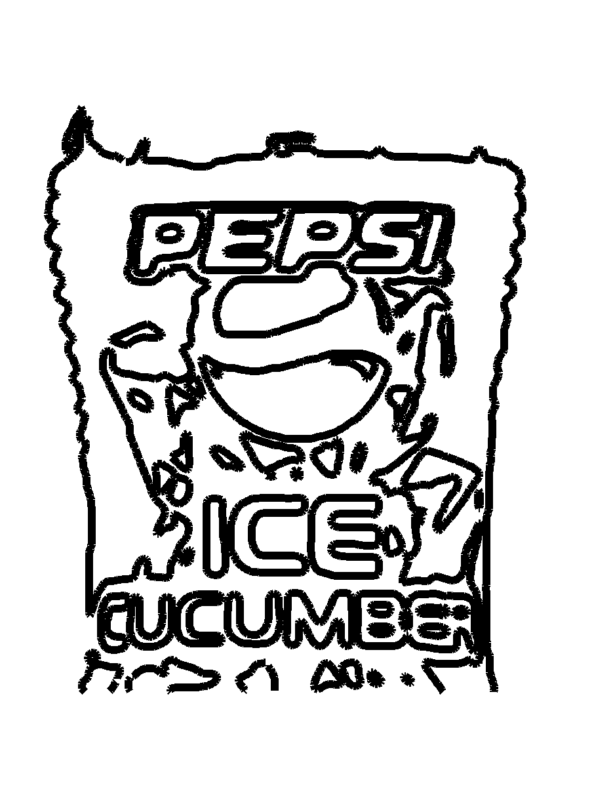
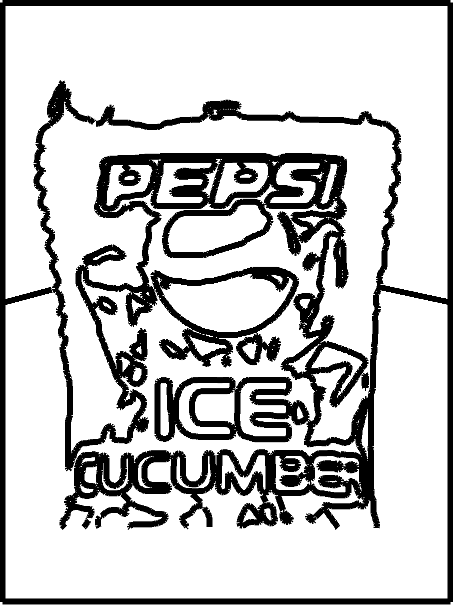
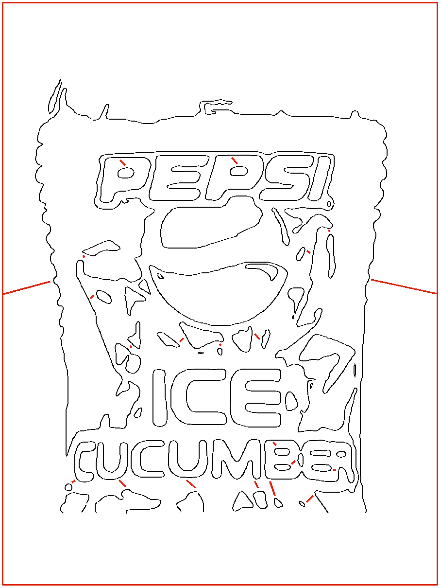

# Pepsi: full-image JAX solve, one black plate, Blender contours

This is the corrected image-driven study for [issue 12](https://github.com/Reid-Surmeier/Jax-Solve-Slicer/issues/12). It uses the exact supplied `source.png` in the adjacent rejected draft; it does not redraw the Pepsi logo, ICE, CUCUMBER, or the ice by hand.

1. `single_black_solve.py` converts all 906×906 source pixels to grayscale and runs the preserved JAX alpha optimizer for 700 steps with one black ink on white paper. `black-alpha16.png`, `black-alpha-float32.npz`, `black-composite.png`, and `solve-receipt.json` are its outputs. The resulting composite RMSE against the grayscale target is **0.000935**. This is a faithful single-color tonal target, not a proposed deposited toolpath.
2. `alpha_contours.py` extracts a selected level from that plate. `--threshold` and `--blur-px` can change the contour input without editing source code. `source-contours.json` is the data passed to Blender.
3. Blender 4.3.2, reached through Blender MCP 2.0.0, built `jax-contour-study.blend`. The **JAX plate | contour controls** Geometry Nodes group exposes **Sample spacing mm** and **Smooth iterations**. `contour-study.svg` was exported from the evaluated node result, not from source curve coordinates. Raising spacing from 1 to 2 mm changed evaluated points from 5,327 to 2,680.
4. `evaluate_contours.py` rendered the actual exported SVG at hairline and nominal 3 mm width. The hairline preview shows image-derived typography and ice contours. The 3 mm preview shows collisions and loss of fine separation.
5. `connect_lattice.py plan` found 20 separate deposited regions at the 3 mm footprint. It generated 19 short links from the islands to the main contour region and two links from that region to a 9×12 inch rectangular frame. The links are computed from the evaluated contour footprint, not placed by hand. `jax-connected-lattice.blend` holds the editable contour and link objects, and `connected-lattice.svg` contains the evaluated Blender geometry. `connect_lattice.py verify` renders that SVG and finds **one connected deposited region** inside the page.






The review overlay shows only the generated links and frame in red; the exported painting geometry is entirely black.



## Constraint result

`path-evaluation.json` reports **63 contour SVG paths**, where the original one-stroke requirement was **one**. At a nominal 3 mm width, **5,152 raster pixels** are covered by at least two distinct contour paths. `lattice-evaluation.json` reports **85 paths total** after the frame and links, **one connected deposited region**, and **5,691 pixels** where distinct paths overlap. The frame's deposited bounds are exactly 0–228.6 mm X and 0–304.8 mm Y; the square image occupies the center 228.6×228.6 mm. The new links touch existing material intentionally. This is a connected material lattice, not a continuous non-overlapping extrusion route. Machine travel and physical adhesion are unverified. Do not send this SVG to the extruder.

The remaining toolpath problem is to choose which black-plate features deserve the limited 3 mm footprint, then route them as a single noncrossing, non-retracing curve while preserving the supplied letterforms as far as that physical width allows. The connected lattice solves the floating-island constraint at the nominal raster footprint; it is still reference geometry for that route planner.

## Reproduce

Use the existing JAX environment and Blender installation:

```bash
/home/reidsurmeier/plotter-separation-rebuild/.venv/bin/python modules/blender_recipes/single_black_solve.py
/home/reidsurmeier/plotter-separation-rebuild/.venv/bin/python modules/blender_recipes/alpha_contours.py --threshold .4 --blur-px .7
/home/reidsurmeier/.local/opt/blender-4.3.2/blender -b --factory-startup --python modules/blender_recipes/alpha_contours_blender.py
/home/reidsurmeier/plotter-separation-rebuild/.venv/bin/python modules/blender_recipes/evaluate_contours.py
/home/reidsurmeier/plotter-separation-rebuild/.venv/bin/python modules/blender_recipes/connect_lattice.py plan
/home/reidsurmeier/.local/opt/blender-4.3.2/blender -b --factory-startup --python modules/blender_recipes/alpha_contours_blender.py -- --with-lattice
/home/reidsurmeier/plotter-separation-rebuild/.venv/bin/python modules/blender_recipes/connect_lattice.py verify
```

The initial contour `.blend` was built through the live Blender MCP connection. The connected `.blend` was built with the same Blender 4.3.2 `bpy` script in headless mode. The headless commands may create ignored `.blend1` backups. The source scripts stay in their respective modules; the preserved legacy solver is called but not modified.
