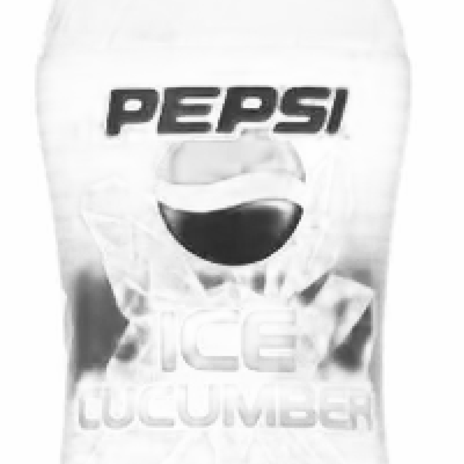
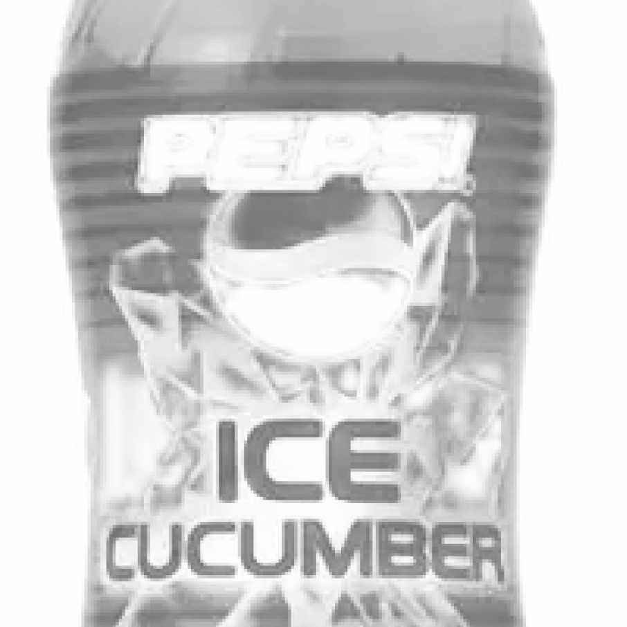
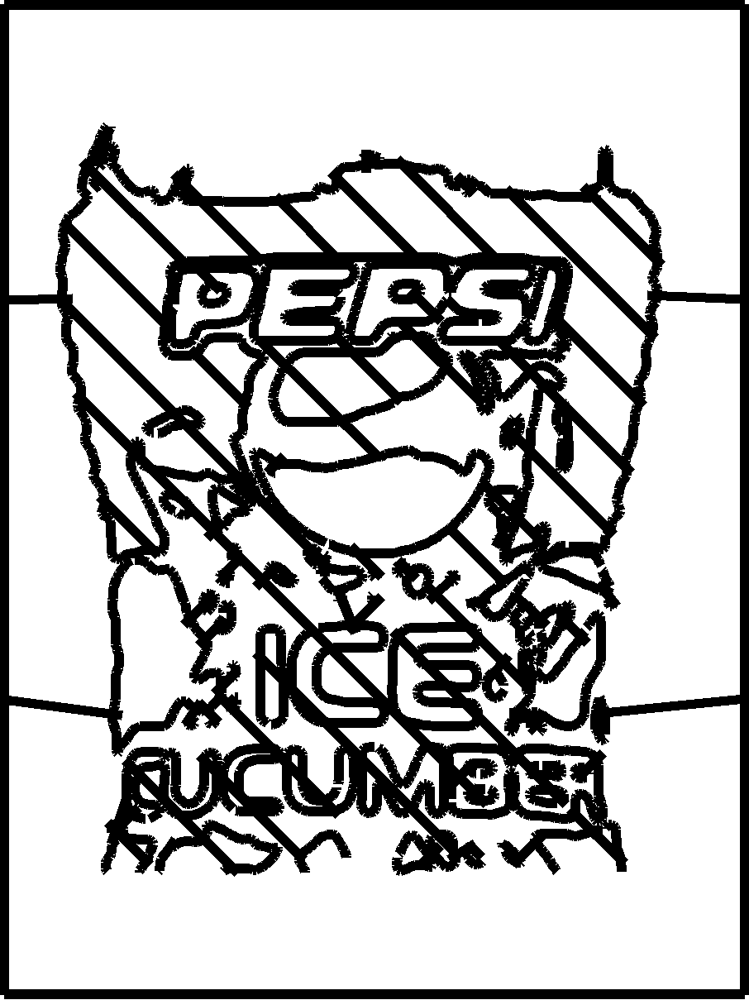
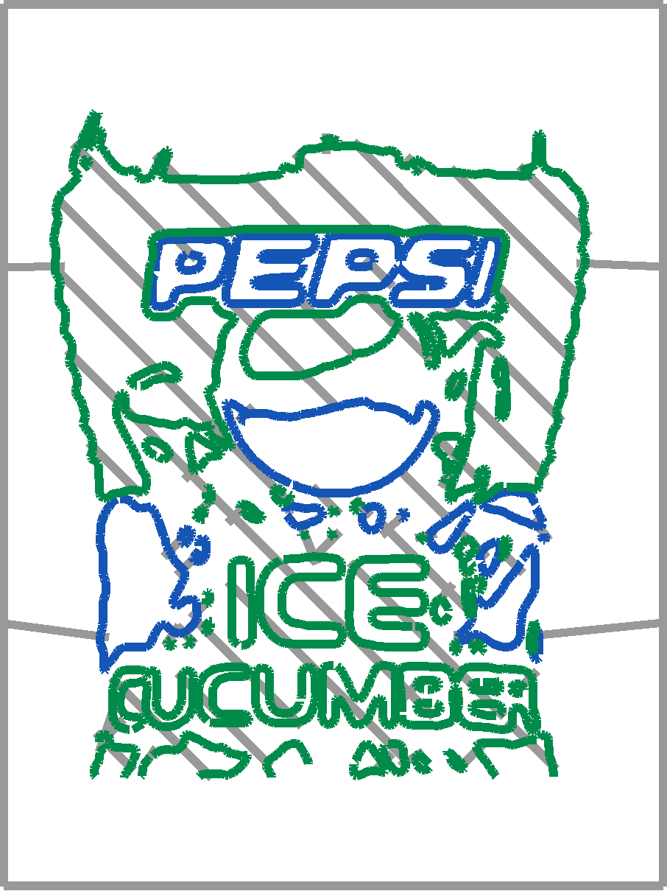
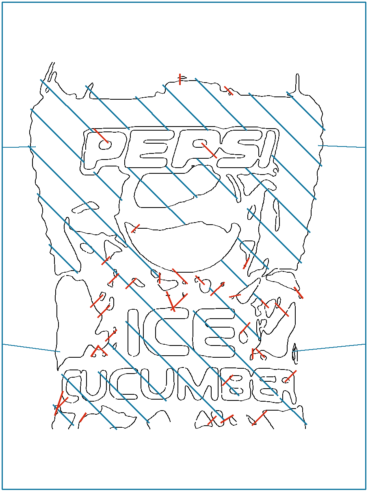

# Pepsi two-pass freestanding lattice study

This replaces the rejected short-link prototype under [issue 12](https://github.com/Reid-Surmeier/Jax-Solve-Slicer/issues/12). The supplied 906×906 image stays the source. The goal is one **black plastic material layer** within 9×12 inches, using two distinct image solves and shading strokes that attach the contours to each other and to a frame.

## What was built

1. `two_plate_solve.py` splits source luminance density by its blue-versus-green channels. It runs the preserved 700-step JAX alpha solver **twice**, once against each source-derived grayscale target with one black ink. Blue carries PEPSI and the globe; green carries ICE, CUCUMBER, and bottle shading. Each solve's target RMSE is about 0.00094. The two target images and solved alpha plates are saved separately.
2. `two_plate_contours.py` traces each solved plate at adjustable thresholds. `two_plate_blender.py` creates two editable Geometry Nodes contour groups, each with sample-spacing and smoothing controls. It exports the **evaluated** curves into one SVG `<g id="one-black-plastic-layer">`; no letterform is manually rebuilt.
3. `two_plate_support.py plan --pitch-mm 24.2` derives diagonal shading ribs from the green plate's bottle silhouette and avoids blue-dominant regions. It keeps ribs that intersect at least two existing contours, adds four frame ties, then finds and crosses the actual centerlines of remaining isolated curves. The support is editable as a separate Blender curve object in `merged-material.blend`.





The black preview hides plate provenance. In the inspection render below, **blue** is the blue target's 20 SVG contours, **green** is the green target's 58 SVG contours, and **gray** is the 69 support and frame paths. The green solve supplies the outer bottle silhouette, ICE, CUCUMBER, and much of the cucumber and ice detail. At the 3 mm preview width, 104,291 of its 134,572 drawn pixels (77.5%) are outside the blue and support strokes. Colors here identify source paths only; the exported material remains one black layer.



The review image colors the generated shading and frame blue and the final centerline links red. The exported SVG uses black for every stroke.



## Geometry result and limit

`material-evaluation.json` reports **one connected region** for the merged SVG when rendered at 2, 4, 8, and 12 px stroke widths on a 906×1209 grid. At this scale, 12 px represents the nominal 3 mm deposited width; the 2 px check shows that links cross the drawn centerlines instead of merely touching the edges of full-width strokes. The deposited bounds are **0–228.6 mm × 0–304.8 mm**. The one-material SVG contains **147 paths**: 20 blue contours, 58 green contours, and 69 shading, link, and frame paths.

This is a **topology and visual prototype**, not a verified freestanding part. Raster contact at 0.25 mm per pixel does not measure weld strength, extrusion flow, stiffness, or attachment under load. The 147 paths also do not meet the earlier one-start/one-end requirement; depositing the overlaps needs a travel and extrusion plan. Do not send the SVG to the machine without physical validation and toolpath planning.

## Reproduce

```bash
/home/reidsurmeier/plotter-separation-rebuild/.venv/bin/python modules/blender_recipes/two_plate_solve.py
/home/reidsurmeier/plotter-separation-rebuild/.venv/bin/python modules/blender_recipes/two_plate_contours.py --blue-threshold .3 --green-threshold .3
/home/reidsurmeier/.local/opt/blender-4.3.2/blender -b --factory-startup --python modules/blender_recipes/two_plate_blender.py
/home/reidsurmeier/plotter-separation-rebuild/.venv/bin/python modules/blender_recipes/two_plate_support.py plan --pitch-mm 24.2
/home/reidsurmeier/.local/opt/blender-4.3.2/blender -b --factory-startup --python modules/blender_recipes/two_plate_blender.py -- --with-lattice
/home/reidsurmeier/plotter-separation-rebuild/.venv/bin/python modules/blender_recipes/two_plate_support.py verify
```

The Blender scene and SVG are regenerated after changing contour controls or shading pitch; the support plan carries a hash of the evaluated contour SVG and rejects a stale plan. Blender may create ignored `.blend1` files. The legacy solver remains unchanged.
