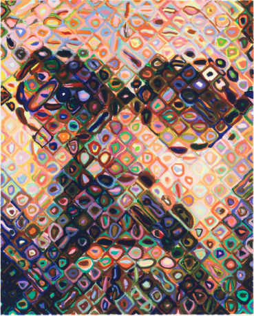
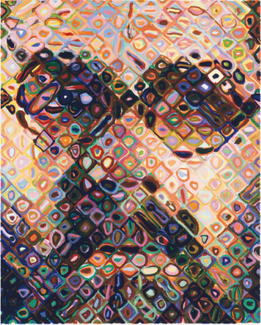
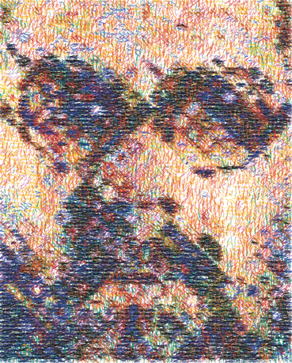
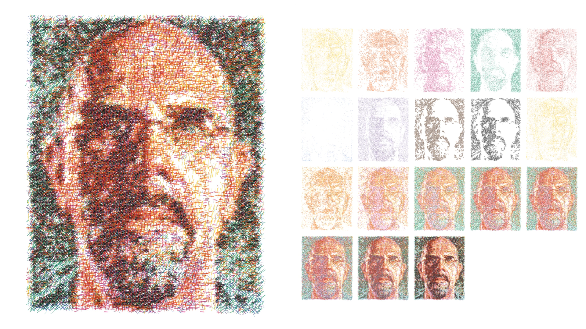

# Your reference through the recovered plotter workflow

The supplied painting was cropped to its painted rectangle and passed through the unchanged JAX alpha solver, fixed-coverage SVG generator, and mark-build animator. This is an execution of the recovered Python workflow, not a Blender prototype.

| Input | Final JAX alpha composite | Actual exported SVG |
| --- | --- | --- |
|  |  |  |

[Watch the new mark-build animation](painting-mark-build.mp4) · [Download the layered SVG](painting.svg) · [Inspect the alpha plates](alpha-plates.png)

## Is it the same system as the archived animations?

The recovered SVG implementation identifies itself as the proof35b fixed-coverage method. It includes portrait and bathroom exports that are byte-identical to the movies in `ReidSurmeier/plotter-image-animations`. Below is the archived portrait at 24 seconds:



We also regenerated the separately preserved regression run with the current recovered code. Its layered SVG **and its full 208-frame MP4 match their saved originals byte for byte**. This verifies the recovered generator and animator against that run. It does not recover the exact alpha plates, parameters, or contact-sheet assembly command for the public 25-second portrait movie. The new animation uses the recovered artwork-only animator's default timing, not a reconstructed copy of that movie layout.

## What a mark means here

The generator emits filled line/lozenge paths. Alpha coverage controls their number and dimensions. Each ink layer has one of six base angles, with deterministic angular variation. Rotation is not fitted to image features. Width and length vary, so these are not yet calibrated impressions of a fixed-size physical painting tool.

The separate legacy DiffVG experiment optimizes position, rotation, length, curvature, and width, including image-oriented loss. That experiment produced a different 90-second three-monitor film. It must not be confused with the archived 25-second plotter movies.

The supplied reference contains colored loops and irregular shapes. This unchanged generator translates them into short marks; it does not extract a bank of those original shapes. Whether to retain this behavior or use fixed physical tool footprints is an open design decision.

## Verified run

- Solver: `plotter-separation-rebuild` at `3047e9375ba8688f76144c89359387f1af706096`; SVG/animation: `plotter-line-drawing-svg` at `ebb28918cafba8db13d33488c5ed0ea47c45826e`.
- Input: 369 × 459 pixels, crop `(117, 121, 486, 580)` from the supplied screenshot. No upscaling; 12-ink palette; 700 solver steps; JAX 0.10.0 selected a CUDA device.
- Output: 64,754 marks. Alpha-composite RGB RMSE: 0.017080 on normalized RGB. This measures the RGB alpha solve, not SVG quality or physical paint accuracy.
- All 22 existing SVG/animation tests passed, including the real SVG-to-MP4 test. Source, alpha composite, actual SVG image, and animation frames were visually inspected.
- Reference SVG SHA-256: `94e9c8338224b4c299007bb2bc0bdc468eb3ee6040744044478fb9ff799e6af3`; reference MP4: `5666eee5f8dcf5113ca52f577534ba6daf3971c8fbe71ef9b0bd329da5aeb603`.

The JAX path used here is RGB alpha blending. Actual Mixbox calls exist in an older Mokuhanga path, as documented in [the lineage research](https://github.com/Reid-Surmeier/Jax-Solve-Slicer/blob/ed82183/docs/research/legacy-baseline.md). This run is not proof of optical pigment accuracy.

## Reproduce

Use the pinned legacy repositories and a Python environment containing their documented dependencies. NumPy, Pillow, `rsvg-convert`, and FFmpeg are sufficient to replay the packaged alpha stack; JAX is only needed to solve the source again.

From this evidence directory, with `SVG_ROOT` pointing to the pinned SVG repository:

```bash
PYTHONPATH="$SVG_ROOT/src" python -m plotter_line_drawing_svg.cli alpha /tmp/painting-svg-replay
PYTHONPATH="$SVG_ROOT/src" python -m plotter_line_drawing_svg.svg_animation /tmp/painting-svg-replay/master_coverage_svg.svg /tmp/painting-animation-replay --output-name painting-mark-build.mp4 --width-px 720
```

To solve from the cropped input, with `SOLVER_ROOT` pointing to the pinned solver:

```bash
XLA_PYTHON_CLIENT_PREALLOCATE=false python "$SOLVER_ROOT/scripts/generate_micron_alpha_plates.py" source.png /tmp/painting-alpha-replay --target-mode full --upscale none --steps 700 --palette full12 --seed 2001
```

The packaged alpha metadata retains the ink set and solve settings while removing temporary machine paths. [receipt.json](receipt.json) records versions and file hashes. Existing legacy source and saved runs were preserved.
